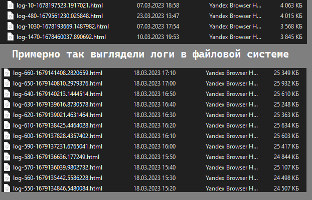
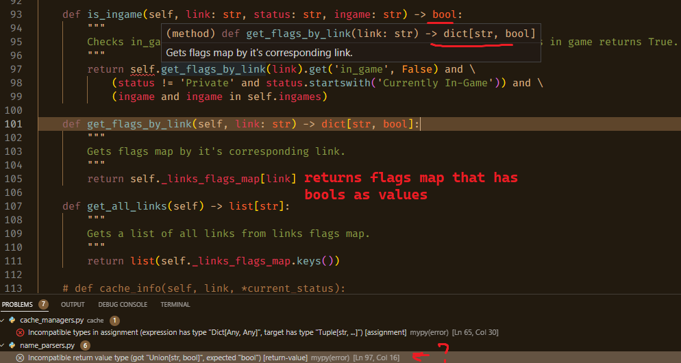

# A2S Player Search
## Вводная
Данное приложение парсит сервера и оповещает о появлении игроков с актуальными заданными именами на них, чьи адреса определены в data/servers_ips.txt или получены с помощью запроса к мастер серверу Valve.  
Сервера должны реализовывать A2S протокол Valve.  
Имена задаются как ссылки на страницы аккаунтов в Steam вместе с флагами в этом файле links_options.hjson, тогда имена будут обновлятся в соответствии с этим аккаунтом в начале каждого цикла, либо напрямую с помощью конфига и поля HARDCODED_NAMES в секции MAIN.

Также оно умеет:
  * Использовать Valve Master Server для автоматического поиска адресов серверов согласно фильтрам (Master Server Query Protocol реализовывал лично);
  * Получать актуальные имена серверов на момент начала работы скрипта;
  * Оповещать, когда предоставленный пользователем аккаунт находится в одной из игр согласно опции конфига INGAMES и флагу in_game;
  * Использовать кэш в ОЗУ для ServerParser'ов, ServerNameParser'ов и NameParser'ов. Кэш при этом выгружается (сериализуется) с диска и сохраняется на диск в начале и конце работы;
  * Исключение имен и серверов или их комбинаций через команды в консоль;
  * Кэш также может работать (и работает по умолчанию для парсера актуальных имен при запуске с асинхронной точки входа) на основе текстового формата сериализации и десериализации некоторых встроенных Python типов придуманного и реализованного мной (см. cache/bazed_strings)

Стоит отметить то, что сервер в ответ на A2S запросы может отдавать самую разную информацию, даже неверную.  
Делается это для привлечения игроков и сокрытия информации от таких приложений как это.
К примеру, в игре Rust сервера по умолчанию дают неверную информацию об игроках.

Также распространены прокси серверы ведущие на один и тот же сервер, но при этом индексируемые мастер сервером как разные.
Такие проблемы в рамках данного приложения решить невозможно.

Это приложение очевидно раздуто бОльшим количеством фич, чем необходимо.
В этом проекте есть применение всех способов конкурентного исполнения кода: от asyncio до многопроцессности; все парсеры имеют по асинхронной и синхронной реализации, а кэш из памяти может выгружаться на диск в виде Pickle, HJSON, и текстового формата.  
Все по причине цели этого проекта — добавлять фичи для применения своих знаний и набирания опыта, хотя и изначально приложение являлось маленьким проектом для пробы работы с A2S (dedicated game server протокол Valve) на базе UDP.

Важно: уведомления (и, скорее всего, само приложение) будут работать только на Windows.

## Запуск
Для большей эстетичности терминала рекомендую запускать с помощью Windows Terminal из App Store.

### Автоматический способ
1. Клонировать репозиторий
1. Запустить setup.bat
1. Запустить arun.bat для асинхронной версии, srun.bat — для синхронной

### Ручной способ (если не работает автоматический способ)
1. Клонировать репозиторий
1. Создать Python envioronment с именем env (важно для работы батников)
1. В этой среде установить зависимости из requirements.txt
1. Запустить arun.bat для асинхронной версии, srun.bat — для синхронной

## Примеры работы
По-идее, тут должны быть встроенные гитхабом видео, но проверить локально не могу. Возможно, тут будут только простые ссылки на видео.

### Пример без оповещений и имен  

https://user-images.githubusercontent.com/24192051/228918755-8d89fd9a-c8e9-4316-89cc-959bbd1e5db8.mp4

### Пример с оповещениями от мэтчей захардкоденных имен и работой команд исключений

https://user-images.githubusercontent.com/24192051/228914611-3873e465-28d4-4ccc-8663-599de41e17b9.mp4

### Пример с оповещениями от мэтчей актуального имени по профилю и работой команд исключений
(там в процессе повтороного парсинга серверов игрок Gunner сменил сервер, поэтому исключение по серверу для него не отработало  
— или точнее — сервер сам сменил порт)  

https://user-images.githubusercontent.com/24192051/228918881-377d8421-b880-46b9-a415-139f8e7624e1.mp4

### Пример с оповещениями от мэтчей текущей игры статуса профиля со списком INGAMES

https://user-images.githubusercontent.com/24192051/228918974-c4e6b03a-6393-4e5b-81e2-4ef99e03acdb.mp4

## Парсинг имён
Для начала, необходимо задать информацию необходимую для получения имён.  
Сделать это можно либо, как уже было сказано выше, через конфиг, либо с помощью ссылки на профиль в Steam.     
Запись ссылок на аккаунты Steam производится в links_options.hjson по схеме:  
```json
{
    "steam_account_url": {"on_server": true, "in_game": false}
}
```
Для оповещения о мэтче актуального ника необходимо включить флаг "on_server". При мэтче без включенного флага имя (как и любое другое замэтченное, в том числе исключенное) просто пишется в консоли в конце цикла.  
Для оповещения о мэтче игры, в которой находится интересующий нас профиль согласно его статусу, со списком INGAMES необходимо включить флаг "in_game".

Механизм мэтчинга найденнных имён соотносит концовки имен игроков на серверах с теми, которые были найдены NameParser'ом или объявлены в списке HARDCODED_NAMES (см server_parsers.py):  
```python
if player_name.endswith(name):
    ...
```
Простое соответствие на равенство нежелательно из-за префиксов имен, иногда добавляемых серверами. При этом постфиксы достаточно редки, чтобы в парсинге их не учитывать.  
В случае ложно-положительных мэтчей, достаточно исключить лишние имена с помощью exclude функционала.

## Исключение имён
Если существует необходимость убрать ложно-позитивные уведомления о мэтче имен на серверах, можно воспользоваться функционалом команд исключения имён с таким синтаксисом:  

    __all__ name        (to exclude name on all servers)
    1.1.1.1:0 __all__   (to exclude server for all names)
    1.1.1.1:0 name      (to exclude name on one server)

Исключённые имена не будут вызывать уведомления, однако все еще будут отображаться в консоли.

## Общая структура кода
Стэк:
* python-a2s — для запросов A2S к имплементирующим его серверам
* winotify — для уведомлений
* aiohttp, requests — для запросов с целью парсинга на страницах профилей Steam
* bs4 — для парсинга страниц профилей
* rich — для красивого консольного вывода (и вырезанных теперь логов)
* hjson — для сериализации и десериализации: конфигов, links_options и кэша на основе HJSON формата (см. cache/cacheable_data.py)
* threading — для ввода команд исключения
* asyncio — для исполнения асинхронного кода

Из особенностей архитектуры приложения стоит отметить использование ABC и Protocol классов. Я не смог определиться, что лучше использовать, поэтому решил использовать их обоих (оверкилл, но это просто проба протокольных классов).  
ABC классы используются для определения общего и абстрактного функционала, а протокольные классы для типизации (информации о принимаемом типе поля, параметра и т.д.).

Старался использовать типы и при этом не ухудшать читаемость лишним кодом. Например, если в родительском классе уже определены типы параметров и возвращаемого значения, то в потомке типов уже стоять не будет.

Также следует знать, что для некоторой части функционала написаны тесты и бенчмарки, которые запускаются при индивидуальном запуске соответстующих .py файлов.

Другие подробности, скорее всего, можно найти в самих исходниках. 

1. config.hjson — разбитый на секции/модули конфиг

1. links_options.hjson — JSON объект с ссылками на профили и флагами, что определяют в каких случаях вызывать уведомления

1. arun/srun.bat — батники для запуска асинхронной и синхронной версий приложения

1. source/asource.py — точки входа для приложения, вызывают main с разными аргументами

1. main.py — база, фундамент всего приложения, планирует использование всего функционала, определённого в других модулях, и добавляет поддержку команд исключения

1. server_parsers.py — определение ServerParser'ов (протоколов, ABC, синхронной и асинхронной версии). Объекты этого типа парсят имена на серверах 

1. server_name_parsers.py — определение ServerNameParser'ов (протоколов, ABC, синхронной и асинхронной версии). Объекты этого типа парсят имена серверов

1. name_parsers.py — определение NameParser'ов (протоколов, ABC, синхронной и асинхронной версии). Объекты этого типа парсят страницы профилей для получения имён и статусной информации в том числе для in_game оповещений

1. master_server_querier.py — собственноручная реализация Master Server Query протокола, обернутая в класс

1. notifications.py — определение функций, вызывающих Toast уведомления на Windows

1. папка data — содержит файлы кэша и захардкоженные серверные адреса

1. пакет cache — содержит реализацию кэша и пакет bazed_strings

    1. пакет bazed_strings — содержит реализацию моего текстового формата данных и необходимую для его работы функциональность по деордеризации объектов типа OrderedDict (возможно иерархию пакетов надо было делать по-другому, но для меня так выглядело чище)
___
## Прочее

### Почему HJSON а не обычный JSON?
    Одна единственная причина — возможность комментировать (про jsonc узнал уже гораздо позднее).
  
### Зачем закомментирована (вырезана) возможность логгирования?  
  

    Таковы размеры логов при разных значениях MAX_PACKETS_PER_REQUEST (1—4) и прочих равных в дефолтном конфиге.  
    То есть, при включенном логгировании подобные файлы будут появляться каждые 10 минут.  
    Во втором случае хватило бы ~6-7 часов работы скрипта для забивания ЗУ на 1 гигабайт,  
    что неприемлимо для постоянного скана на не серверном железе и требует регулярной ручной очистки и надзора.  
    В общем, не стоило делать логи в .html формате за счет rich библиотеки.

### Зачем type: ignore'ы?
    Из-за подобных случаев (на скрине в cache_managers.py тоже была ложная ошибка типизации):
  

    К тому же, Python типизаторы постоянно требуют скачать стабы, которые мне совершенно не нужны,  
    и при этом продуцируют ещё больше бессмысленных ошибок.
